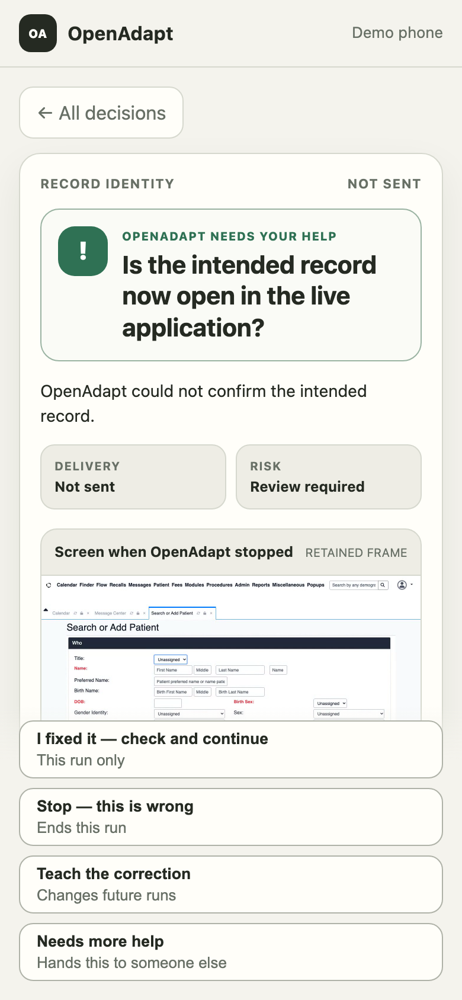

# OpenAdapt Desktop

[](https://github.com/OpenAdaptAI/openadapt-desktop/actions/workflows/test.yml)
[](https://www.python.org/downloads/)
[](LICENSE)

The desktop app you record workflows in, watch them run, and teach when they
halt. It's a Tauri shell driving a frozen Python engine, and the engine embeds
the exact `openadapt-flow` runtime it was built against, so there's no separate
Python to install.

**There is no signed build to download right now.** The next native release is
blocked until macOS has Developer ID plus notarization, Windows has
Authenticode, and the exact Linux bytes verify under GitHub OIDC attestation.
The latest published prerelease predates that gate and keeps its original
unsigned labels. If you want to run an OpenAdapt workflow today, use the
launcher instead:

```bash
pip install 'openadapt[browser]'
openadapt quickstart
```

[Documentation](https://docs.openadapt.ai) ·
[openadapt-flow](https://github.com/OpenAdaptAI/openadapt-flow) ·
[Which release to download](RELEASES.md) ·
[Implementation status](docs/IMPLEMENTATION_STATUS.md)

## What the cockpit does

Start without an account, or connect a Cloud workspace with system-browser PKCE
or a one-time token held in the OS keychain. Then the shell renders a left-rail
cockpit over the live engine:

| Screen | What it does |
| --- | --- |
| Workflows | The library: what you recorded, what compiled, where each one stands |
| Record & review | Start and stop a capture, then step through the local review gate before anything leaves the machine |
| Runner | Pick Browser, Windows, macOS, Linux, RDP, or Citrix, give it only that target's connection details, and watch the live rail, the step log, and the halt evidence |
| Teach | Resolve a halted step and write a governed repair back toward the workflow |
| Settings | Host, deployment lane, credentials, local preferences |

Recording and sync are two independent status channels on the rail, alongside
the needs-attention break count. In a plain dev checkout the shell shows an
engine-offline state, because the frozen sidecar is built only in CI.

## Answering a halt from your phone

When a governed run needs a person, Desktop pairs a phone with a one-use QR
code and a matching code. The phone gets one signed task, whatever evidence the
customer-controlled runner is allowed to show, and only the actions Flow
permits at that pause.

<p align="center">
  
</p>

The screen is a request, not an approval. Tapping it doesn't bless a stale
screenshot and doesn't prove a business effect. The runner goes back to the
live application, repeats the state, identity, and target checks, and returns a
typed result; a refusal leaves the run paused where it was.

The local portal can serve an approved retained raster frame over the
customer's own HTTPS origin behind a reverse proxy or VPN. The hosted outbound
lane carries a signed, remote-safe task with no pixels in it. One limit worth
knowing before you design a policy around this: pairing authenticates the
device session, not the named operator principal that a qualification contract
may require for attribution.

The screenshot is the real phone shell with synthetic data. Its
[capture provenance](docs/assets/mobile-decision/provenance.json) is recorded,
and the full contract, including pairing, evidence handling, reconciliation,
escalation, and terminal receipts, is in
[docs/DECISION_PORTAL.md](docs/DECISION_PORTAL.md).

## How the two processes fit together

```text
Desktop authoring/teaching cockpit (Tauri + React)
        |
        | local IPC (JSON lines over sidecar stdio; token-authenticated
        | loopback socket for the tray)
        v
Frozen Python engine sidecar (capture, review, auth, sync, FlowBridge,
                              pinned openadapt-flow runtime)
        |
        | isolated subprocess mode in the same signed executable
        v
openadapt-flow
  record -> compile -> lint/certify -> replay -> halt/repair/teach
```

The engine owns consent, OS permissions, recording and review, hosted
authentication and push, and a `FlowBridge` that runs the pinned Flow build as
an isolated subprocess. The shell also runs a token-authenticated loopback
socket so [`openadapt-tray`](https://github.com/OpenAdaptAI/openadapt-tray) can
mirror status and send local commands.

None of the compiler or the runtime lives here. That's all `openadapt-flow`,
and this repository is the cockpit and the local wiring around it.

## The engine CLI

The Python engine runs from a plain checkout, without the shell:

| Command | Purpose |
|---|---|
| `record`, `list`, `info` | Capture a session and inspect its metadata |
| `scrub`, `review`, `approve`, `dismiss` | Drive the local review state machine; a dismissal keeps the raw data local |
| `compile`, `replay`, `run` | Call the bundled pinned Flow runtime on a capture or a bundle |
| `login`, `credential`, `rotate`, `push`, `report-break` | Authenticate to the control plane, check or renew the stored credential, push a bundle, report a halted run |
| `backends`, `upload` | Inspect the legacy customer-owned storage adapters. Hosted uses governed `push`; customer-owned upload is paused behind a fail-closed gate. |
| `storage`, `health`, `cleanup` | Inspect and maintain local storage |
| `config`, `capabilities`, `doctor` | Local configuration, execution-surface availability, and dependency checks |

Recordings are local by default. Any egress path still needs you to look at the
selected adapter, the configuration, the logs, and your data-classification
policy. Nothing in this repository by itself makes a deployment HIPAA-compliant.

`push` delegates to Flow's exact-hash sanitized derivative contract and never
falls back to a direct upload when Flow is missing or errors. The old direct
hosted-ingest backend refuses every upload. Full semantics:
[docs/IMPLEMENTATION_STATUS.md](docs/IMPLEMENTATION_STATUS.md).

## Build it

```bash
git clone https://github.com/OpenAdaptAI/openadapt-desktop.git
cd openadapt-desktop
uv sync --extra dev --extra build

uv run openadapt-desktop doctor
uv run openadapt-desktop list
uv run pytest tests -q
uv run ruff check engine tests
```

Recording needs the OS permissions and runtime that
[`openadapt-capture`](https://github.com/OpenAdaptAI/openadapt-capture)
requires:

```bash
uv run openadapt-desktop record --task "Inspect capture path"
```

For the shell you also need Rust, Node.js, and the Tauri CLI. A dev shell runs
frontend-only and reports the engine as offline until a CI-built sidecar binary
is present.

```text
engine/       Python capture, review, auth, sync, and FlowBridge code
src-tauri/    Rust/Tauri shell, sidecar lifecycle, tray socket wiring
src/          React cockpit (screens, engine client, primitives)
tests/        Python unit and end-to-end tests, largely mocked at the boundaries
```

[DESIGN.md](DESIGN.md) is a historical reference. Where it disagrees with this
file or with `openadapt-flow`, this file wins.

## What isn't proven yet

- The frozen `openadapt-engine` binary comes only from CI. A dev checkout runs
  frontend-only.
- CI proves the frozen binary's browser record, compile, and replay loop on
  Windows, macOS, and Linux, and it installs, launches, and uninstalls every
  package on clean runners. That's packaging evidence. It isn't workflow
  qualification, which stays specific to the workflow and the environment.
- Native packages are unadmitted release candidates until the central
  Production lifecycle activates an exact release.
- Signing credentials have to be provisioned before the next native release. A
  partial set stops it. The updater and rollback stay disabled until there's an
  independent signing-key lifecycle.
- This repository serves the tray's loopback IPC contract, but Desktop and the
  shipped tray client have never been validated together end to end.
- Desktop starts without downloading a browser. The first browser workflow
  pulls the Chromium revision pinned by the bundled Playwright runtime into
  `~/.openadapt/browser-runtime`, showing progress and a retryable failure, and
  no workflow action starts until it's ready. Air-gapped packages point
  `PLAYWRIGHT_BROWSERS_PATH` at a version-matched prebundle. Native, RDP, and
  Citrix workflows never touch that path.

Area-by-area detail, including the substrate evidence boundaries:
[docs/IMPLEMENTATION_STATUS.md](docs/IMPLEMENTATION_STATUS.md).

## Native installers

Native packages ship under a `desktop-vX.Y.Z` prerelease channel, separate from
the engine's `vX.Y.Z` PyPI and GitHub releases, with the native version
synchronized to the engine release CI built it from. Every filename encodes its
platform, architecture, and signing state. New release filenames require
`developer-id-notarized` on macOS, `authenticode` on Windows, and
`github-attested` for the exact Linux bytes.

On macOS, ad-hoc CI uses a non-hardened overlay, because an identity-less
hardened launcher can't load PyInstaller's identity-less embedded libraries.
Developer ID builds keep the hardened runtime and pass the same Apple identity
into both PyInstaller and Tauri, and the installed-app smoke test runs bundled
Flow after the final signing pass, so a structurally valid but unloadable app
can't get out.

Third-party licenses sit beside the components they cover and are verified
against the actual frozen archive; pinned sources, hashes, and modification
status are in [`third_party/README.md`](third_party/README.md).

- [RELEASES.md](RELEASES.md): which release to download, and the two-lane policy.
- [docs/RELEASE_CANDIDATE_INSTALLERS.md](docs/RELEASE_CANDIDATE_INSTALLERS.md):
  artifact names, verification scope, provenance.
- [docs/CODE_SIGNING.md](docs/CODE_SIGNING.md): the activation runbook, what to
  buy, which secrets to add, and what each surface may then truthfully claim.

## License

[MIT](LICENSE)
